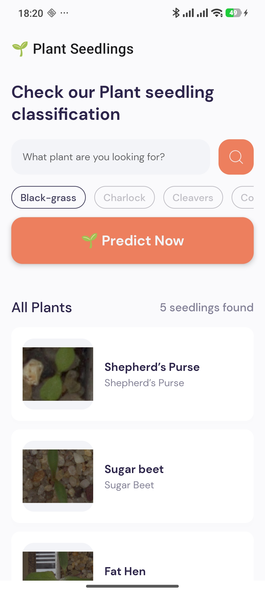
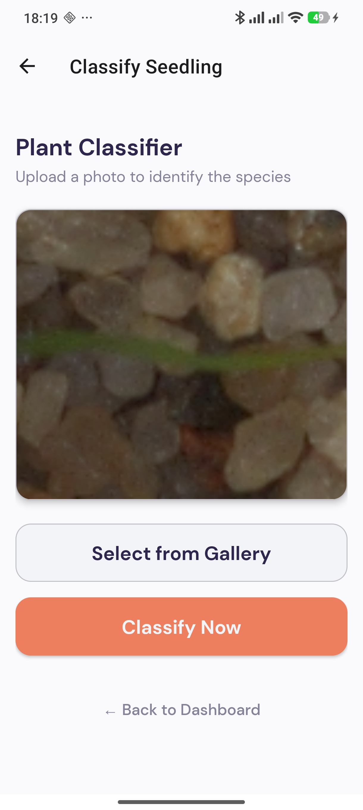
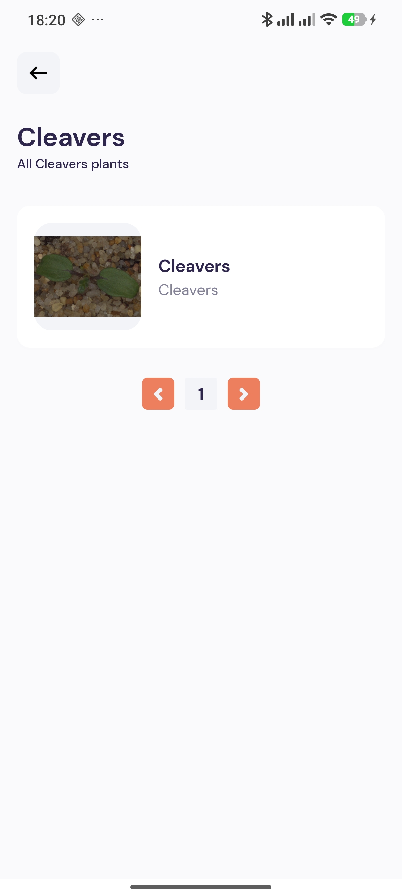

# 🌱 Plant Seedlings Classification System

A full-stack AI-powered mobile application designed to identify plant seedling species. The system combines a Deep Learning model, a Flask REST API, and a React Native mobile interface.

---

## 🧠 AI Model
The core of the system is a **Convolutional Neural Network (CNN)** trained to classify seedlings into 12 distinct species.

- **Architecture**: Based on modern CNN architectures (optimized for image feature extraction).
- **Format**: Saved as a `.keras` model.
- **Input Size**: 224x224 RGB images.
- **Supported Species**:
    - Black-grass, Charlock, Cleavers, Common Chickweed, Common wheat, Fat Hen, Loose Silky-bent, Maize, Scentless Mayweed, Shepherd’s Purse, Small-flowered Cranesbill, Sugar beet.

---

## 🖥️ Backend API (Flask & MySQL)

The backend serves as the brain of the operation, handling image processing, database management, and API orchestration.

### **Tech Stack**
- **Framework**: Flask (Python)
- **Database**: MySQL (relational storage for classification history)
- **Image Processing**: TensorFlow, Keras, PIL, NumPy

### **Core Functionalities**
- **Image Preprocessing**: Resizes and normalizes incoming images to match the CNN input requirements.
- **Data Persistence**: Stores every classification result (filename, species, timestamp) in a MySQL database.
- **Pagination & Sorting**: Efficiently serves large classification histories to the mobile app.

### **Key API Endpoints**
| Endpoint | Method | Description |
| :--- | :--- | :--- |
| `/predict` | `POST` | Uploads an image, processes it via CNN, and returns the classification. |
| `/getAllImages` | `GET` | Retrieves the history of all classifications (Supports `page` and `per_page` params). |
| `/getOneImage/<id>` | `GET` | Fetches details and the Base64 image data for a specific classification. |
| `/getAllImagesByClassification`| `GET` | Filters classifications by species name. |

---

## 📱 Mobile Frontend (React Native & Expo)

A premium, user-friendly mobile application built for researchers and farmers to identify seedlings in the field.

### **Tech Stack**
- **Framework**: React Native (Expo)
- **Routing**: Expo Router (v2)
- **Styles**: Custom theme with shadows and professional typography.
- **Connectivity**: Configured for both Emulator (`10.0.2.2`) and Physical Devices (`127.0.0.1` via ADB reverse).

### **Interfaces & Screenshots**

#### **1. Dashboard**
The central command center. Users can search for plants, browse categories, or see a paginated list of all previous classifications.
- **Feature**: Real-time auto-refresh after new predictions.
- **UI**: Premium cards with image previews and classification labels.



#### **2. Plant Classification (Predict Page)**
The primary tool for identification.
- **Feature**: Gallery selection and one-tap classification.
- **UI**: Styled result cards with species identification emoji.



#### **3. Search & Filter**
Dedicated view for exploring specific species.
- **Feature**: Category-based filtering from the home screen leads here.
- **UI**: Clean list view with navigation back to dashboard.



---

## 🛠️ Installation & Setup

### **Backend (Python)**
```bash
cd plant-seedling-classification
pip install -r requirements.txt
# Create a .env file and add your database credentials:
# DB_HOST=localhost
# DB_USER=root
# DB_PASSWORD=your_password
# DB_NAME=plants_classification
python app.py
```

### **Mobile (React Native)**
```bash
cd plant-seedlings-classification-mobile
npm install
npx expo start
```

### **Physical Device Connection**
If using a phone over USB, run:
```bash
adb reverse tcp:5000 tcp:5000
```

---

## ✍️ Author
**Ahmed Bouzazi**
